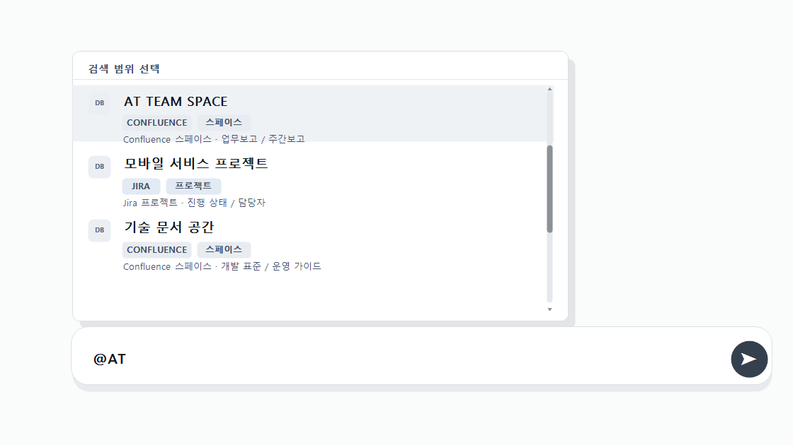
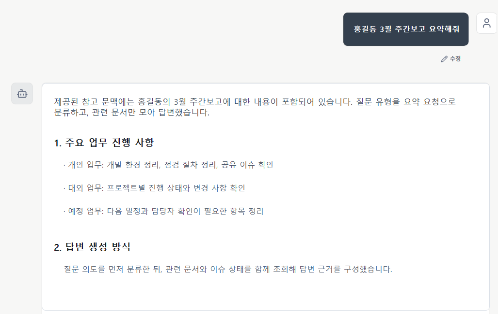
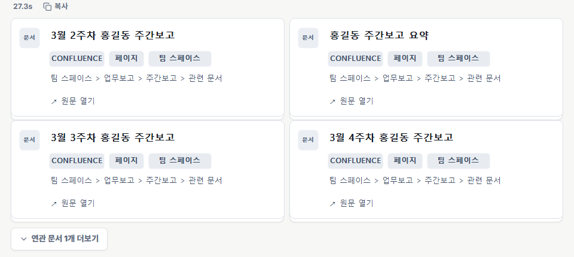
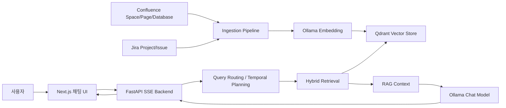

# MetsaBrain RAG

MetsaBrain RAG는 Atlassian Confluence와 Jira 데이터를 Qdrant에 인덱싱하고, 하이브리드 검색으로 관련 문맥을 찾아 Ollama 기반 LLM 답변을 스트리밍하는 지식 검색/질의응답 시스템입니다.

프론트엔드는 Next.js 채팅 UI, 백엔드는 FastAPI SSE API로 구성되어 있으며, 문서 수집부터 검색 범위 지정, 출처 확인, 자동 재인덱싱까지 한 흐름으로 사용할 수 있게 설계되어 있습니다.


## 주요 기능

- **Atlassian 수집:** Confluence space/page/table/Live Doc fallback, database metadata, Jira smart link를 수집합니다.
- **Jira 문맥화:** Jira project, issue, comment, custom field, status summary를 함께 인덱싱합니다.
- **하이브리드 검색:** Qdrant vector search, keyword/BM25, title score, temporal query expansion, long-document policy를 조합합니다.
- **명시적 검색 범위:** 채팅 입력창에서 `@` mention으로 특정 Confluence space 또는 Jira project를 선택할 수 있습니다.
- **근거 확인:** 답변에 사용된 문서를 source card로 보여주고 원문 링크를 제공합니다.
- **안전한 재인덱싱:** 새 chunk 저장이 성공한 뒤 이전 chunk를 삭제해 실패 시 기존 인덱스를 보존합니다.
- **스트리밍 답변:** FastAPI SSE와 Ollama chat model로 답변을 실시간 스트리밍합니다.

## 화면 예시

### `@` 멘션으로 검색 범위 지정

질문 입력 중 `@`를 입력하면 접근 가능한 Confluence space와 Jira project를 검색하고, 선택한 범위 안에서 우선 검색합니다.



### 질의 유형별 검색 라우팅

질문이 단일 문서 조회, 주차/월/분기 범위 요약, Jira 상태 요약, 긴 문서 요약 중 어디에 가까운지 판단해 검색 전략을 다르게 적용합니다.



### 출처 카드와 원문 접근

답변 아래에는 사용된 문서를 카드로 표시합니다. 문서 종류, source type, breadcrumb, 원문 링크를 함께 제공해 답변 근거를 빠르게 확인할 수 있습니다.



## 구조



주요 디렉터리:

```text
backend/   FastAPI 앱, ingest, retrieval, RAG chain, scheduler 관련 코드
frontend/  Next.js 채팅 및 문서 관리 UI
assets/    README 예시 이미지
tests/     백엔드 회귀 테스트
```

## 요구사항

- Python 3.11 이상
- Node.js 18 이상
- Ollama
- Qdrant
- Confluence/Jira 수집용 Atlassian Cloud API token

현재 기본 모델명은 다음과 같습니다.

```env
OLLAMA_MODEL=qwen3.5:9b
EMBEDDING_MODEL=qwen3-embedding:8b
```

로컬 또는 운영 환경의 모델명이 다르면 `.env` 또는 `.env.local`에서 수정하세요.

## 환경변수

템플릿을 기준으로 로컬 환경파일을 만듭니다.

```powershell
Copy-Item .env.example .env.local
```

주요 설정:

```env
CONFLUENCE_URL=https://your-domain.atlassian.net
CONFLUENCE_EMAIL=your_email@example.com
CONFLUENCE_API_TOKEN=your_atlassian_cloud_api_token_here

OLLAMA_HOST=http://localhost:11434
QDRANT_HOST=http://localhost:6333

NEXT_PUBLIC_API_URL=/api
BACKEND_INTERNAL_URL=http://localhost:8000
```

Jira는 기본적으로 Confluence와 같은 Atlassian Cloud 계정/API token을 재사용합니다. Jira가 다른 site 또는 다른 계정을 써야 할 때만 `JIRA_URL`, `JIRA_EMAIL`, `JIRA_API_TOKEN`을 설정합니다.

실제 `.env`, `.env.local`, API token, 실행 로그, local report는 커밋하지 마세요.

## 로컬 백엔드 실행

```powershell
pip install -r backend\requirements.txt
cd backend
python -m uvicorn main:app --host 0.0.0.0 --port 8000 --reload
```

## 로컬 프론트엔드 실행

```powershell
cd frontend
npm install
npm run dev
```

브라우저에서 접속합니다.

```text
http://localhost:3000
```

## Docker 실행

앱 컨테이너를 빌드하고 실행합니다.

```powershell
docker compose up --build
```

로컬 개발에서 Ollama/Qdrant를 외부 서버로 사용할 경우 `.env.local`의 `OLLAMA_HOST`, `QDRANT_HOST`를 접근 가능한 주소로 지정하세요.

## 데이터 수집

백엔드는 다음 수집 흐름을 지원합니다.

- UI에서 Confluence/Jira 수동 수집
- 접근 가능한 Confluence space와 Jira project 검색
- 이미 등록된 source 대상 scheduled re-indexing
- 안전한 교체 저장 방식
  - 새 chunk를 먼저 저장합니다.
  - 저장 성공 후에만 이전 chunk를 삭제합니다.
  - 실패하면 이전 정상 snapshot을 보존합니다.

Confluence Database는 현재 database metadata를 인덱싱합니다. Database row/entry 본문까지 필요하면 CSV/HTML export 파일 ingest 또는 page에 렌더링된 database view 파싱 경로를 별도로 붙이는 방식이 적합합니다.

## 테스트

백엔드 테스트는 `tests/` 디렉터리에 있습니다.

```powershell
python -m unittest discover -s tests -p "test_*.py" -v
```

회귀 테스트는 다음 핵심 동작에 집중합니다.

- ingest 안전성
- Qdrant collection vector dimension 검증
- query routing
- hybrid retrieval
- long-document context policy
- streaming finish reason
- query logging
- retrieval evaluation helper
- 내부 네트워크 allowlist

## 공개 스냅샷 안내

이 브랜치는 GitHub 공개용으로 정리한 코드 스냅샷입니다. 내부 운영 문서, 실제 운영 환경값, 실제 Atlassian 평가 데이터셋, 로컬 분석 리포트는 포함하지 않습니다.

## 보안 주의사항

이 프로젝트는 조직 문서, 고객명, 이슈 데이터, 접속 정보, credential을 다룰 수 있습니다. 공개 GitHub 저장소에 올리기 전에 다음을 확인하세요.

- `.env`, `.env.local`, runtime log, local report, generated artifact가 ignore되고 있는지 확인합니다.
- 커밋된 적 있는 token은 폐기하고 새로 발급합니다.
- README, screenshot, local report에 내부 hostname, 사용자명, 고객 민감정보가 없는지 확인합니다.
- 백엔드 API를 외부에 노출하려면 trusted network 제한만으로는 부족하므로 별도 인증/인가를 추가해야 합니다.
